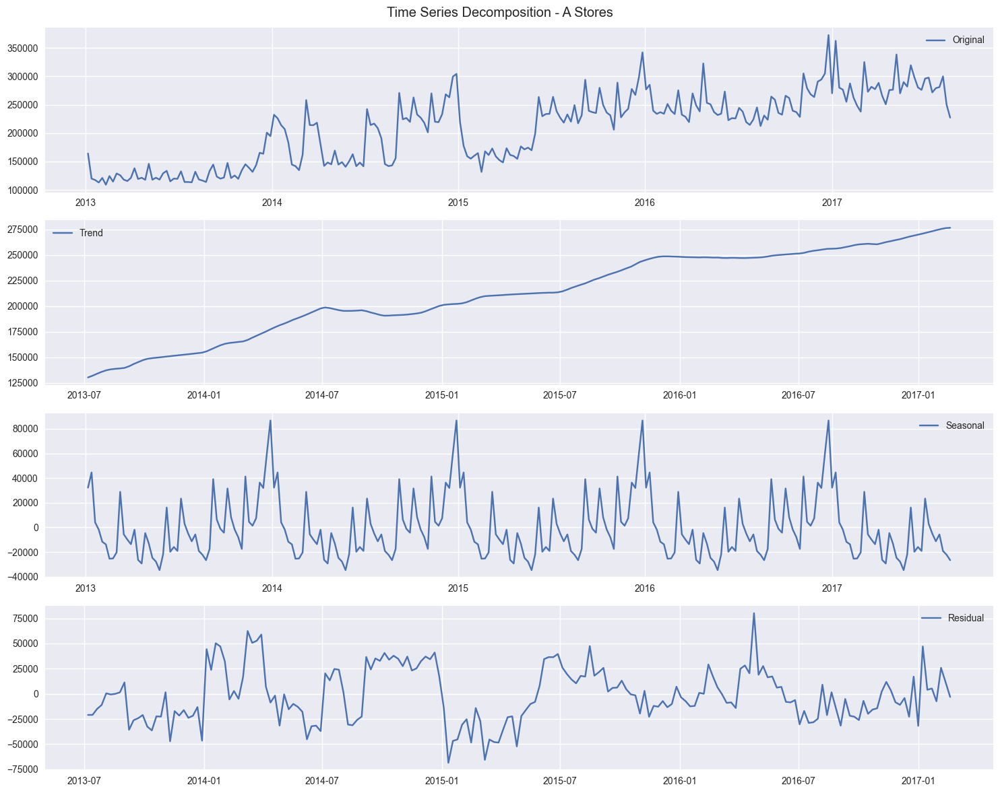

# RevWave 🌊

A comprehensive retail sales analysis and forecasting project. Using advanced data analytics and interactive visualizations, RevWave helps businesses understand their sales patterns and make data-driven decisions with sophisticated time series modeling (SARIMA and Holt-Winters).

## Project Visualizations 📈

### Weekly Sales Patterns

*Comprehensive analysis of weekly sales patterns showing seasonal trends, overall growth, and market dynamics*

### Store Type Performance Analysis
RevWave analyzes different store types to uncover unique performance patterns and optimization opportunities:

#### Type A & B Stores
| Store Type A | Store Type B |
|:------------:|:------------:|
|  |  |
| *High-volume urban locations* | *Suburban retail centers* |

#### Type C & D Stores
| Store Type C | Store Type D |
|:------------:|:------------:|
|  |  |
| *Mid-size market stores* | *Premium locations* |

#### Type E Stores

*Specialized retail locations with unique sales patterns*

### Forecasting Results

*Advanced SARIMA model forecast demonstrating predicted sales trends and patterns*

### Confidence Intervals

*Forecast reliability assessment with 95% confidence intervals for precise decision-making*

## Features ✨
- **Multi-dimensional Analysis**: Comprehensive analysis across different store types and product categories
- **Time Series Decomposition**: Advanced trend and seasonality analysis
- **External Factor Analysis**: Impact evaluation of holidays and oil prices on sales
- **Comparative Modeling**: SARIMA vs Holt-Winters forecasting models
- **Interactive Visualizations**: Rich, interactive dashboards for deep insights

## Technical Stack 🛠️

- **Core**: Python 3.x
- **Data Processing**: Pandas, NumPy
- **Visualization**: Plotly, Matplotlib, Seaborn
- **Modeling**: statsmodels, scikit-learn

## Getting Started 🚀

1. Clone the repository:
```bash
git clone https://github.com/KhayredineG/rev_wave.git
cd rev_wave
```

2. Create and activate virtual environment:
```bash
python -m venv .venv
.venv\Scripts\activate  # Windows
source .venv/bin/activate  # Unix/MacOS
```

3. Install dependencies:
```bash
pip install -r requirements.txt
```

4. Download the dataset from [Kaggle Store Sales Competition](https://www.kaggle.com/competitions/store-sales-time-series-forecasting/data)

5. Open and run the analysis notebook:
```bash
jupyter notebook notebooks/sales_analysis.ipynb
```
- **Interactive Computing**: Jupyter Notebooks

## Getting Started 🚀

1. Clone the repository:
```bash
git clone https://github.com/KhayredineG/rev_wave.git
cd rev_wave
```

2. Create and activate virtual environment:
```bash
python -m venv .venv
.venv\Scripts\activate  # Windows
source .venv/bin/activate  # Unix/MacOS
```

3. Install dependencies:
```bash
pip install -r requirements.txt
```

4. Download the dataset from [Kaggle Store Sales Competition](https://www.kaggle.com/competitions/store-sales-time-series-forecasting/data)

5. Explore the analysis in `notebooks/sales_analysis.ipynb`

---

### **Project Tasks and Workflow**

**Phase 1: Data Acquisition and Preparation**

1.  **Data Ingestion:**
    *   Load the sales dataset (e.g., from a CSV file) into a Pandas DataFrame.
    *   (Optional Bonus Task): Set up a local PostgreSQL or SQLite database, import the CSV data into a `sales` table, and then use Python's `sqlalchemy` or `psycopg2`/`sqlite3` libraries to query the data and load it into your DataFrame. Practice writing SQL queries to aggregate data by month or product category before loading.

2.  **Data Cleaning and Preprocessing:**
    *   Handle missing values in critical columns (`Units_Sold`, `Price`). Justify your choice of imputation method (e.g., mean, median, forward-fill).
    *   Ensure the `Date` column is in the correct datetime format and set it as the DataFrame index.
    *   Check for and handle any duplicates or anomalies (e.g., negative sales units, zero price).
    *   Create new features (feature engineering), such as `DayOfWeek`, `Month`, `Year`, and `Revenue` (`Units_Sold` * `Price`).

**Phase 2: Exploratory Data Analysis (EDA)**

*   **Overall Sales Trend:** Plot the total monthly or weekly sales revenue over time to visualize the long-term trend.
*   **Seasonality Analysis:**
    *   Use box plots to show sales distribution by month and day of the week to identify seasonal patterns.
    *   Generate a time series decomposition plot (using `statsmodels.tsa.seasonal_decompose`) to separate the trend, seasonal, and residual components of the sales data.
*   **Top Performers:** Identify and visualize the top-performing products, stores, or regions.
*   **Correlation Analysis:** Explore relationships between different numerical features. For instance, is there a correlation between the price of a product and the units sold?

**Phase 3: Time Series Forecasting**

1.  **Model Selection:**
    *   You will implement and compare at least two of the following time series forecasting models:
        *   **ARIMA/SARIMA:** A classical statistical model for time series forecasting. Perform differencing and use ACF/PACF plots to determine the optimal parameters (p, d, q) and (P, D, Q, s).
        *   **Exponential Smoothing (Holt-Winters):** Suitable for data with trend and seasonality.
        *   **Machine Learning Model:** Use `scikit-learn` to implement a regression model (e.g., Linear Regression, RandomForestRegressor) using lagged features and time-based features (`Month`, `DayOfWeek`, etc.) to predict future sales.

2.  **Model Training and Evaluation:**
    *   Split the dataset into a training set and a testing set (e.g., use the last 12 months of data for testing).
    *   Train your selected models on the training data.
    *   Evaluate model performance on the test set using metrics like Mean Absolute Error (MAE), Root Mean Squared Error (RMSE), and Mean Absolute Percentage Error (MAPE).

3.  **Forecasting:**
    *   Using your best-performing model, generate a sales forecast for the next 3 to 6 months.
    *   Visualize the forecast against the historical data, including confidence intervals if applicable.

**Phase 4: Reporting and Deliverables**

Your final submission should be a GitHub repository containing the following:

1.  **Jupyter Notebook (`.ipynb`):** A well-documented notebook that follows the entire workflow from data cleaning to forecasting. It should include code, visualizations, and markdown cells with your analysis, interpretations, and conclusions.
2.  **Cleaned Dataset (`.csv`):** An exported CSV file of the cleaned and preprocessed data.
3.  **A `README.md` file:** This file should provide a clear overview of the project, instructions on how to run the code, a summary of your findings, and your final recommendations based on the analysis (e.g., "Sales peak in November and December, suggesting increased inventory is needed," or "Product X shows declining trend and may need a new marketing push.").
4.  **(Optional) Environment File:** A `requirements.txt` or `environment.yml` file to ensure the reproducibility of your project environment.

This technical prompt provides a structured, end-to-end project that effectively showcases the desired skills using a completely open-source technology stack.